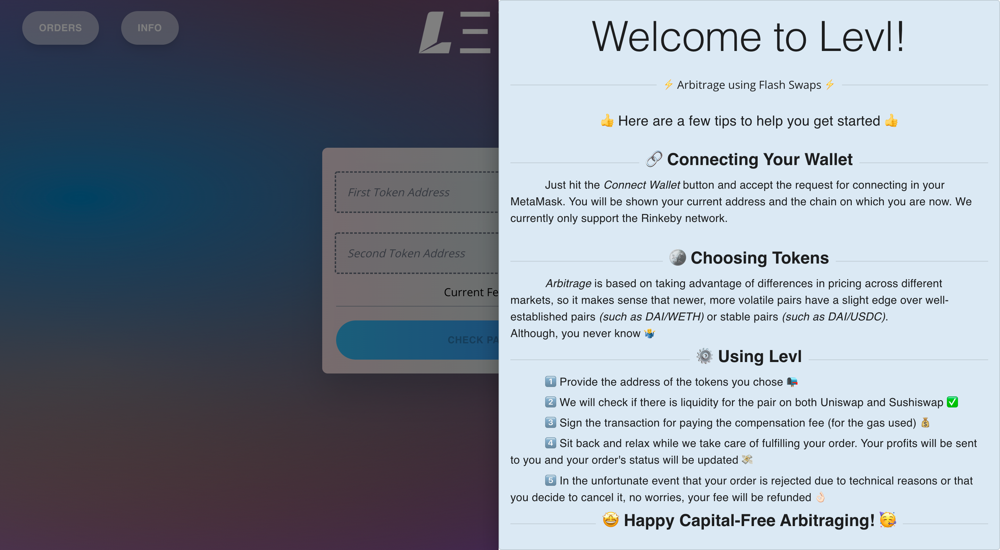
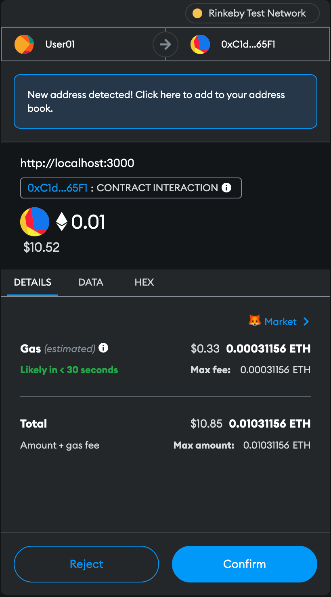
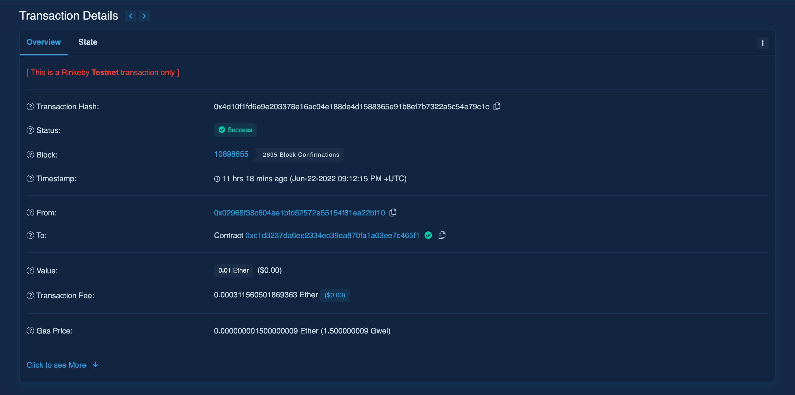
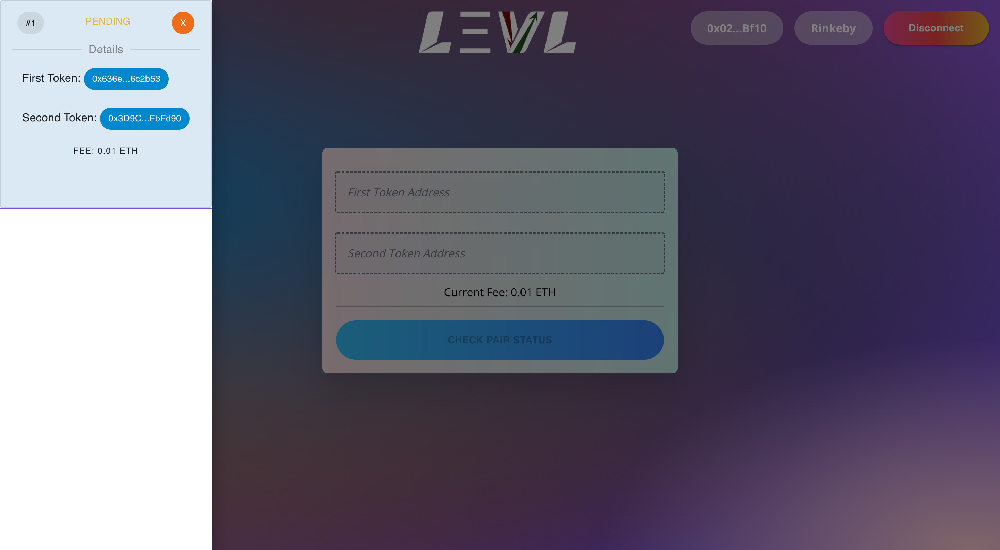
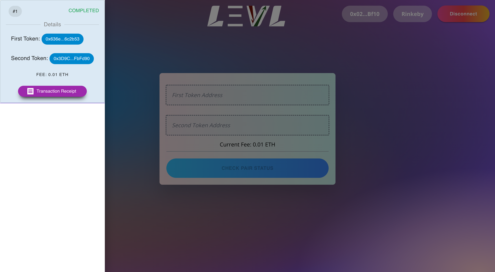
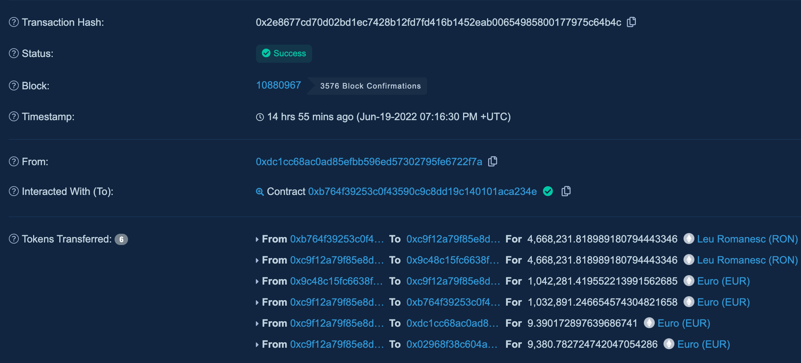

# Ethereum-Arbitrage-Web-Platform

## Contents

1. Description
2. Sample Flow
3. Installation Guide
4. Working Example
5. Further Improvements
6. License

## Description

`Levl - Flash Arbitrage` is a platform that allows users to take advantage of arbitrage opportunities that may arise between Uniswap and Sushiswap.

The _catch_ is that the operation doesn't involve the user's time or capital. The platform is constantly monitoring the user's chosen pairs and executes transaction by first Flash Loaning from one of the DEXes.

## Sample Flow

### Landing Page

When the user connects to the platform this is the very first thing they see.

### Connecting Your Wallet

To connect your MetaMask wallet, click on the `Connect Wallet` button in the top-right.

A preview of your address and the network over which you are connected (in this example, _Rinkeby_) will be shown. To disconnect, simply press the `Disconnect` button.

### Showing the Guide

In order to show the short informational banner, click on the `INFO` button in the top-left.

### Placing an Order

An order represents the user's wish to track the existence of any arbitrage opportunities for the selected pair.

#### **Requirements**

- An order requires two valid token addresses.

_If not, the field will be marked red, as shown below:_

- The two tokens should exist as a pair on both Uniswap and Sushiswap.
- At the moment, it is also required that each of the tokens is paired with `DAI` (in order to determine an objective valuation of the two tokens)

Fortunately, the platform does all of these checks, so no worries here.

#### **Placing the Order**

Simply enter the addresses of your tokens in the two input fields and hit the `CHECK PAIR STATUS` button.

If there are errors, there will be a red alert displayed in the bottom-left, explaining the reason behind the failure, like shown:

If everything is alright, though, there will be a green alert displayed in the bottom-left. Afterwards, click the `PLACE ORDER` button.

## Confirming the Order

You will be asked to confirm the transaction for the order creation and pay a _fee_. The fee is used to cover for the gas expenses involved and nothing more.

Again, a green alert will be shown in the bottom-left if everything goes smoothly.

### Sample Order Placement Transaction

Your transaction should look something like this.

### Showing Orders

If you have at least _one_ `CONFIRMED` Order Placement transaction on etherscan, refresh the page and click on the `ORDERS` button in the top-left.

### Order Status

An order can have one of the following statuses:

- PENDING - the order has been picked up, but there has yet to be an opportunity for executing it
- CONFIRMED - the order has been executed and the proceeds have been sent to the user's wallet

  _In this particular case, the transaction receipt is also available and clicking the button will redirect to etherscan._

- REJECTED - if there are problems that interfer with the execution (e.g. lack of liquidity), the order will be rejected and the order will not be tracked anymore

  _If this is the case, you should cancel the order._

- DELETED - the order has been cancelled by the user
  _In case of cancelling an order, the fee for covering the gas costs is returned to the user's wallet._

### Cancelling an Order

To cancel an order, simply click on the `x` button placed in the top-right of the order card.

### Successful Execution

In case of a successful execution, you will find the funds in your wallet. There is no _withdraw_ transaction required on the user's part.

A successfully executed Flash Arbitrage transaction will look something like this:

